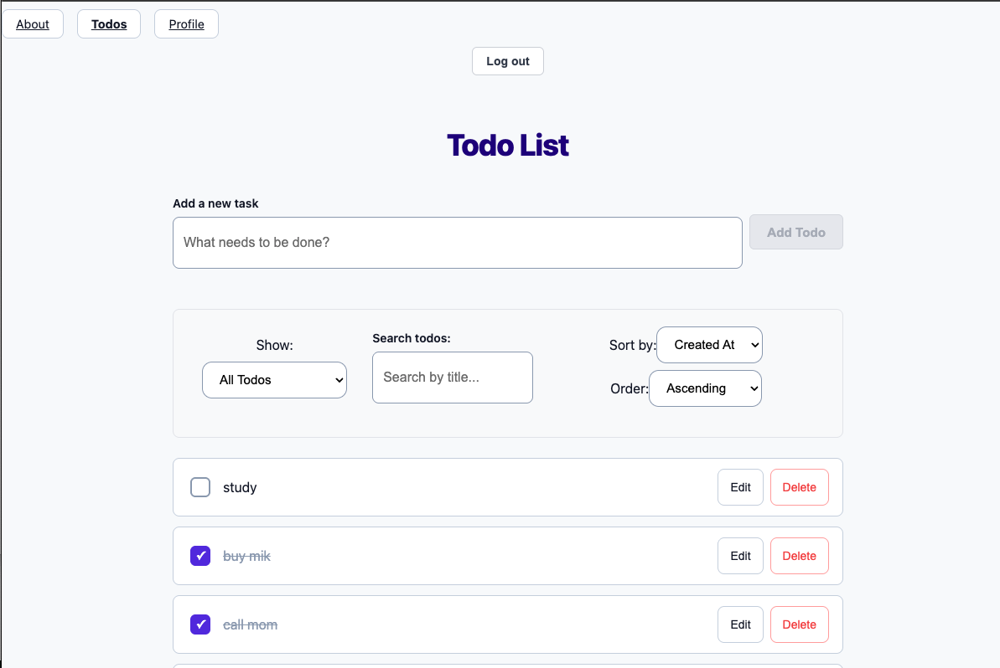
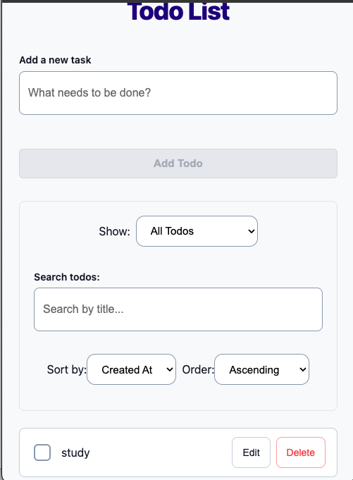

# Todo-list

A modern, responsive full-stack Todo application built with React, React Router, and CSS Modules. This app allows users to create, update, filter, sort, and manage daily tasks with a clean, accessible interface and real-time statistics tracking.

## Demo Video

youtube demo link : https://youtu.be/fhn8yLNIGnQ

## Features List

* **Authentication System**: Secure user login and authorization session management.
* **Todo Management**: Full CRUD operations—Create, Read, Update and Delete tasks.
* **Status Filtering**: Filter tasks by status (`All`, `Active`, `Completed`).
* **Live Search**: Instant text-based filter input with custom debouncing.
* **Custom Sorting**: Sort tasks by title or creation date in ascending or descending order.
* **User Profile & Stats**: Interactive profile view displaying total tasks, active count, completion percentage, and dynamic progress bars.
* **Responsive Layout**: Designed for seamless usability across desktop, tablet, and mobile viewports with touch-friendly targets.
* **Accessible UI**: Keyboard-navigable controls utilizing `:focus-visible` styling to maintain focus rings without mouse click clutter.

## Design Decisions

* **CSS Modules for Scoped Styling**: Chosen over global CSS or inline styles to avoid class name collisions, ensure strict component encapsulation, and keep layout definitions modular and maintainable.
* **Context API & Custom Hooks for State**: Utilized React's Context API alongside `useReducer` to manage global authentication and todo state centrally, while custom hooks like `useDebounce` optimize search input performance.
* **Accessible & Mobile-First Component Structure**: Standardized touch-friendly UI components with minimal height constraints (44px target sizes) and proper `:focus-visible` outline styles for enhanced keyboard accessibility.

## Technologies Used

* **Frontend**: React, React Router v6+
* **Styling**: CSS Modules (scoped component styles), CSS Custom Properties (Variables)
* **State Management**: React Hooks (`useReducer`, `useState`, `useEffect`, `useContext`)
* **Utilities**: Custom hooks (`useDebounce`)

## Screenshots

### Desktop View 

### Mobile View 

## Getting Started

Follow these steps to set up and run the project locally on your machine.

### Prerequisites

* **Node.js**: `v18.0.0` or higher
* **npm**: `v9.0.0` or higher

### Installation

1. Clone the repository
   
    open bash/terminal

    git clone from (https://github.com/tiyafrancy/todo-list)

2. Install dependencies

    npm install

3. Start the development server

    npm run dev

4. Open in browser

    Navigate to the port indicated in your console.

### Available Scripts

In the project directory, you can run:

npm run dev: Runs the app in development mode using Vite with Hot Module Replacement (HMR).

npm run build: Bundles and compiles the app into static production assets in the dist/ directory.

npm run preview: Locally previews the production build stored in the dist/ directory.

npm run lint: Runs ESLint across the codebase to check for syntax and code formatting issues.

### Future Improvements

Add Dark Mode toggle button

Enable batch deletion for multiple selected todos

### License Information

This project is licensed under the [MIT License](LICENSE)

### Contact Information

GitHub : https://github.com/tiyafrancy
